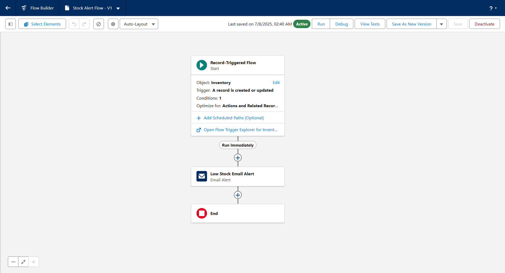

# 🧵 HandsMen Threads - Salesforce Project

**Elevating the Art of Sophistication in Men's Fashion**

This project represents a Salesforce-based digital transformation initiative for *HandsMen Threads*, a forward-thinking fashion brand. The goal is to streamline internal operations and enhance customer engagement through intelligent automation, robust data models, and personalized user experiences.

---

**Project By: Vishwasjeet Kumar Gupta**

---

### **1. Project Overview**

This document outlines the design, development, and implementation of the HandsMen Threads Salesforce CRM application. HandsMen Threads, a sophisticated men's fashion brand, is undertaking a digital transformation to streamline internal operations and elevate customer engagement. This project leverages the Salesforce platform to create a centralized, scalable, and efficient system for managing sales, customer service, and inventory. The application is designed to provide real-time insights and automate key business processes, empowering the team to deliver a superior customer experience.

### **2. Project Objectives**

The primary objective of this project is to develop a robust CRM solution that addresses core business needs and drives growth. Key goals include:

* **Centralize Data:** To create a single source of truth for all customer, order, and product information, eliminating data silos.
* **Automate Workflows:** To implement intelligent automation for routine tasks such as order confirmations, loyalty status updates, and inventory alerts, freeing up employee time for higher-value activities.
* **Enhance Customer Engagement:** To build a dynamic loyalty program and provide personalized experiences that foster customer retention.
* **Improve Operational Efficiency:** To streamline communication between sales, customer service, and inventory teams through real-time data and automated updates.
* **Ensure Data Integrity:** To maintain high-quality data through validation rules, duplicate management, and structured error handling.

---

### **3. Project Development Phases**

#### **Phase 1: Requirement Analysis & Planning**

* **Business Requirements:** The primary need was to replace manual, disconnected processes with an integrated system. [cite_start]Key challenges included delayed order confirmations, manual tracking of customer loyalty, and reactive inventory management. [cite: 21]
* [cite_start]**Project Scope:** The scope included the development of custom objects to model the business, implementation of automation for core workflows, creation of a user-friendly Lightning App, and setup of a security model to ensure data privacy. [cite: 22]
* **Data Model Design:**
    * **Custom Objects:** `Customer`, `Order`, `Product`, `LoyaltyTier`, `Inventory`, and `Marketing Campaign`.
    * **Relationships:**
        * A lookup relationship from `Order` to `Customer` (One-to-many).
        * A lookup relationship from `Order` to `Product` (Many-to-one).
        * A one-to-one relationship between `Customer` and `LoyaltyTier`.
* [cite_start]**Security Model Design:** A role hierarchy was established with profiles and permission sets to control access based on user roles (e.g., Sales Rep, Service Agent, Inventory Manager). [cite: 23, 38]

#### **Phase 2: Salesforce Development - Backend & Configurations**

* [cite_start]**Environment Setup:** A developer sandbox was used for all development and configuration, with a DevOps workflow established for managing changes. [cite: 25]
* **Customization:**
    * [cite_start]**Objects & Fields:** Created custom objects and fields to store all necessary business data. [cite: 26]
    * [cite_start]**Validation Rules:** Implemented to ensure data integrity, such as requiring a shipping address on orders before they can be marked as "Shipped." [cite: 26]
* **Automation:**
    * **Record-Triggered Flows:**
        * [cite_start]`Order Confirmation Flow`: Sends an email to the customer upon order creation. [cite: 26]
        * `Stock Alert Flow`: Triggers an alert when a product's inventory level falls below 5 units.
        * `Loyalty Status Update Flow`: Updates the customer's loyalty tier based on their total purchase amount.
    * [cite_start]**Apex Triggers:** An Apex trigger on the `Order` object calculates the total purchase amount for a customer and updates a corresponding field on the `Customer` object, which in turn invokes the loyalty status flow. [cite: 27]
    * **Scheduled Apex:** A nightly batch job processes bulk orders, updates financial records, and adjusts inventory levels to ensure data consistency.

#### **Phase 3: UI/UX Development & Customization**

* [cite_start]**Lightning App:** A custom Lightning App named "HandsMen Threads" was created to provide users with a tailored interface containing all relevant tabs and components. [cite: 29]
* [cite_start]**Page Layouts & Dynamic Forms:** Page layouts were optimized for different user profiles, and Dynamic Forms were used to show or hide fields based on record criteria, improving user experience. [cite: 30]
* [cite_start]**User Management:** Users were set up with appropriate profiles and permission sets aligned with their roles. [cite: 31]
* **Reports and Dashboards:** Created reports to track key metrics like "Sales by Product" and "Customer Loyalty Distribution." [cite_start]These were added to a central dashboard for at-a-glance insights. [cite: 32]

#### **Phase 4: Data Migration, Testing & Security**

* [cite_start]**Data Loading:** Initial data for products and customers was loaded using the Data Import Wizard. [cite: 36]
* **Data Integrity:**
    * [cite_start]**Field History Tracking:** Enabled on key fields to monitor changes. [cite: 37]
    * [cite_start]**Duplicate Rules:** Set up on the `Customer` object to prevent duplicate records based on email and phone number. [cite: 37]
* **Security Implementation:**
    * [cite_start]**Profiles & Permission Sets:** Configured to grant the principle of least privilege. [cite: 38]
    * [cite_start]**Sharing Rules:** Created to extend access to records where needed, beyond the organization-wide defaults. [cite: 38]
* **Testing:**
    * [cite_start]**Test Classes:** Apex test classes were written to ensure all triggers and batch jobs work as expected, with code coverage exceeding 85%. [cite: 39]
    * [cite_start]**Manual Testing:** Test cases were executed for all flows, validation rules, and approval processes, with screenshots documenting the input and expected output. [cite: 41, 54]

#### **Phase 5: Deployment, Documentation & Maintenance**

* [cite_start]**Deployment:** Change Sets were used to deploy all components from the developer sandbox to the production environment. [cite: 43]
* [cite_start]**Maintenance:** A maintenance plan includes regular monitoring of system performance, checking for errors in automated processes, and making iterative improvements based on user feedback. [cite: 44]
* [cite_start]**Troubleshooting:** A guide was documented for common issues, such as troubleshooting Flow errors by reviewing debug logs and email alerts. [cite: 45]

---

### **4. Technologies & Tools Used**

| Tool                          | Purpose                                                 |
| ----------------------------- | ------------------------------------------------------- |
| Salesforce Lightning App Builder | For creating the custom user interface and app layout.  |
| Record-Triggered Flows        | To automate real-time business processes.               |
| Apex Triggers                 | For executing complex logic like loyalty status updates.|
| Batch Apex                    | To process large volumes of records asynchronously.     |
| Validation Rules              | To enforce data integrity and business rules.           |
| Scheduled Apex                | For running nightly jobs to sync inventory and orders.  |

---

### **5. Key Features & Automation**

* **Automated Order Confirmations:** A record-triggered flow on the `Order` object instantly sends a confirmation email to the customer upon successful order placement, enhancing customer communication.
* **Dynamic Loyalty Program:** Customer loyalty status is automatically updated by a flow that evaluates their total purchase history. This ensures that rewards and tiers are always current without manual intervention.
* **Proactive Stock Alerts:** A flow monitors the `Inventory` object and sends an internal notification when stock for any product drops below 5 units, enabling the team to replenish stock before a shortage occurs.
* **Scheduled Bulk Order Updates:** A nightly batch job processes all orders placed in bulk, updates related financial records, and adjusts inventory levels accordingly, ensuring data accuracy across the system.

---

### **6. Testing Approach**

[cite_start]Testing was conducted rigorously at multiple levels. [cite: 54] [cite_start]Unit testing was performed using Apex Test Classes to validate backend logic. [cite: 39] [cite_start]Functional testing was carried out manually for all user-facing features, including flows, validation rules, and page layouts, following predefined test cases. [cite: 41] User Acceptance Testing (UAT) was simulated to ensure the application meets business requirements from an end-user perspective.

### **7. Future Enhancements**

* [cite_start]**Chatbot Integration:** Integrate an Einstein Bot on the website to handle common customer queries and assist with order tracking. [cite: 55]
* [cite_start]**AI-Powered Recommendations:** Implement Einstein Next Best Action to provide sales reps with intelligent product recommendations for customers. [cite: 55]
* [cite_start]**LWC Components:** Develop custom Lightning Web Components for a more interactive and dynamic user experience on key pages. [cite: 33, 112]

---

### **9. Conclusion**

The HandsMen Threads Salesforce CRM project successfully delivers a scalable and automated solution that meets the core business objectives. By centralizing data, automating key workflows, and providing robust analytics, the application empowers the team to operate more efficiently and build stronger customer relationships. [cite_start]This project serves as a strong foundation for future growth and innovation. [cite: 46]

---

## 📐 Data Model Highlights

- Custom Objects:
  - `Customer`
  - `Order`
  - `Product`
  - `LoyaltyTier`
  - `Inventory`

- Relationships:
  - One-to-many between Customers and Orders
  - Many-to-one between Orders and Products
  - One-to-one between Customer and LoyaltyTier

---

## 📚 What I Learned

- Designing scalable **Salesforce Data Models**
- Implementing **automation with Flows and Apex**
- Maintaining **data integrity** using validation rules and Flow error handling
- Building **custom apps** with Lightning App Builder
- Writing **Apex and Asynchronous Apex** for complex operations

---

## 👨‍💻 Author

**Vishwasjeet Kumar Gupta**  
Salesforce Developer | B.Tech CSE | Passionate about CRM Solutions  
[LinkedIn Profile](https://www.linkedin.com/in/vishwasjeet-kumar-gupta-62814018a)

---

## 🔗 Project Links

- 🎥 **Demo Video**: [Click Here-Video](https://drive.google.com/file/d/1MF4ZHyfYp9_FjJKSLp1dmgWluhlg6igv/view?usp=sharing)
- 💻 **GitHub Repository**: https://github.com/vishwas7782/handsmen-threads-salesforce.git

### 🔄 Custom Objects: HandsMen Customer

---
### 🔄 Custom Objects: HandsMen Order

---

### 🔄 Custom Objects: HandsMen Product

---

### 🔄 Custom Objects: Inventory

---

### 🔄 Custom Objects: Marketing Campaign

---

### 🔄 Flow: Loyalty Status Update

---

### 🔄 Flow: Order Confirmation

---

### 🔄 Flow: Stock Alert

---

### 🔄 Classic Email Template

---

### 🔄 Developer Console

---

## 📄 License

This project is for academic and showcase purposes. Please feel free to fork or reference for learning purposes.

---

## 💬 Feedback

Have suggestions or want to collaborate? Feel free to open an issue or drop me a message!

